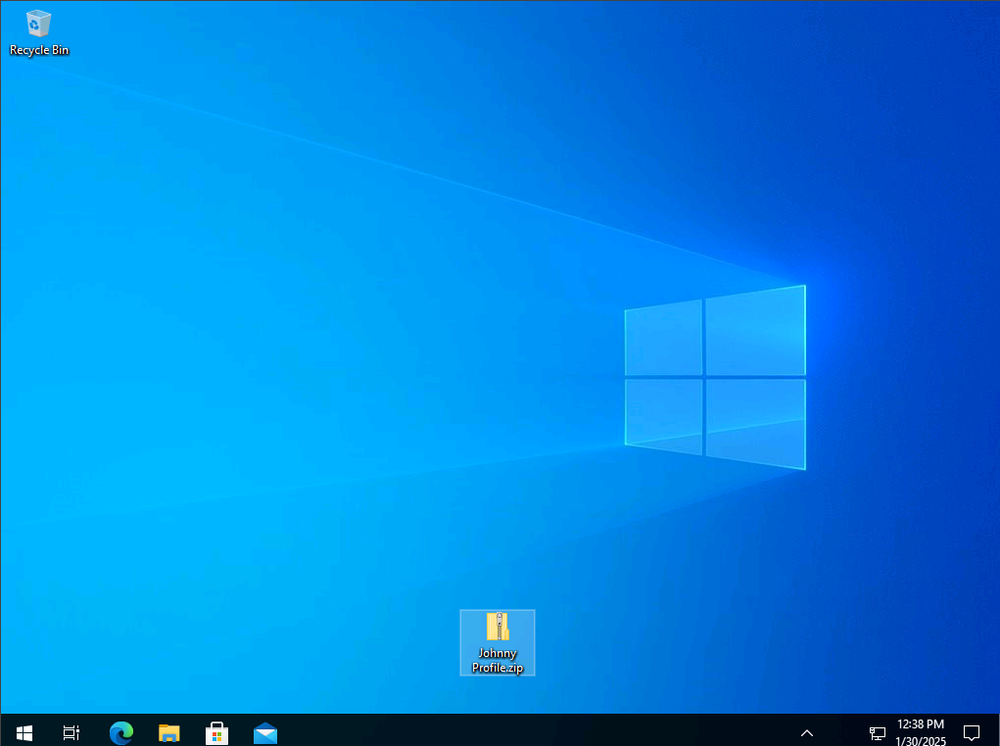
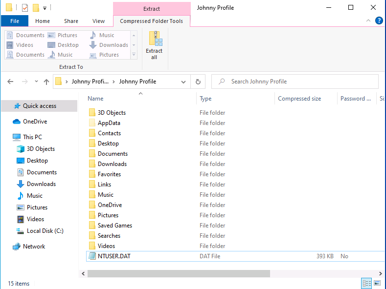
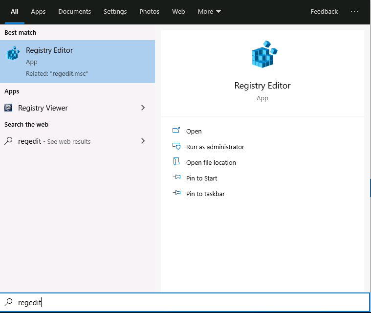
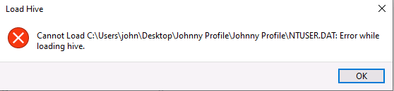
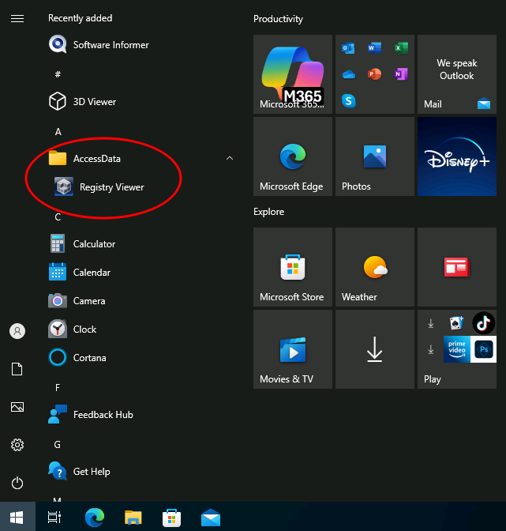
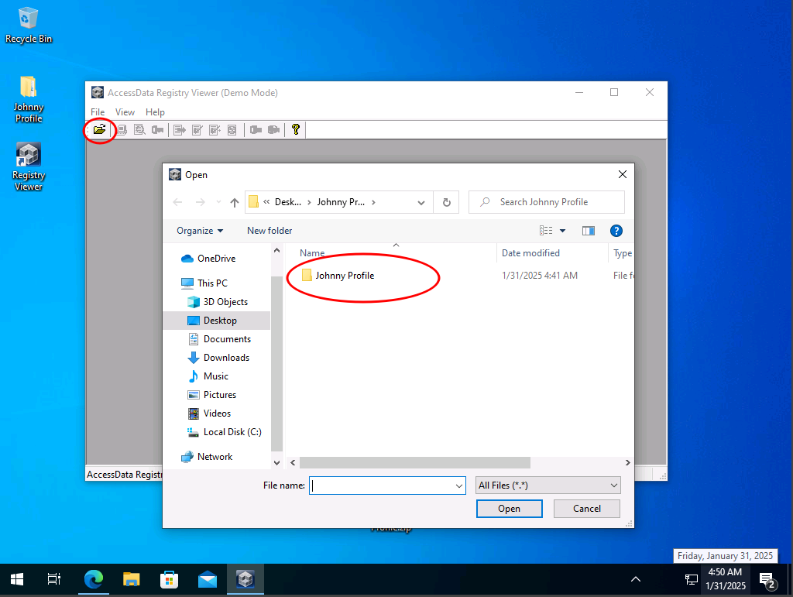

# CTF Writeup: Windows Registry Analysis & Malware Investigation

## Challenge Overview
This challenge requires knowledge of registry analysis, malicious file investigation, and forensic techniques. The target machine runs on a Windows operating system with an IP address of `10.10.1.160`. The objective is to analyze the provided files, identify the malicious file, and determine how it achieves persistence.

### **Credentials for Login**
- **Username:** `john`
- **Password:** `hf$#fgaQsed12`

---
## Initial Discovery
Upon booting into the target machine, the first noticeable item on the desktop is a `.zip` folder.

Extracting the `.zip` file reveals a `.DAT` file inside.

### **Understanding `.DAT` Files**
A `.DAT` file in Windows is a data file that can store various types of information, including:
- Plain text
- Binary data
- Configuration settings
- Video or multimedia content

These files are typically used by specific applications and are not meant to be manually opened by users. In this case, the `.DAT` file found is `NTUSER.DAT`, which stores registry settings for the user profile.

---
## **Attempting to Open `NTUSER.DAT` with `regedit`**
The first approach was to use Windows' built-in Registry Editor (`regedit`). Steps attempted:

1. Open the Start menu and type **"regedit"**.

   

2. In the Registry Editor, navigate to `HKEY_USERS`.
3. Right-click and select **Load Hive...**.
4. Locate the `NTUSER.DAT` file and attempt to load it.
5. When prompted, assign a name to the loaded hive.

However, this method failed due to persistent errors, even when attempted with Administrator privileges.

---
## **Using AccessData Registry Viewer**
Since `regedit` was unsuccessful, an alternative forensic tool, **AccessData Registry Viewer**, was used.

**AccessData Registry Viewer** is a specialized forensic tool from the FTK suite that allows analysts to navigate and extract artifacts from Windows registry hive files.

**Installation Link:** [Download Here](https://accessdata-registry-viewer.software.informer.com/download/)

After installation, a folder appears in the Start menu.

---
## **Analyzing the Registry for Malicious Entries**
To investigate malware persistence, the `NTUSER.DAT` file extracted earlier was loaded into the tool.

Key registry paths to check for persistence mechanisms:
- `HKEY_CURRENT_USER\Software\Microsoft\Windows\CurrentVersion\Run`
- `HKEY_LOCAL_MACHINE\Software\Microsoft\Windows\CurrentVersion\Run`

### **Identifying Malicious Entries**
- Look for registry keys that:
  - Have unusual or misspelled names.
  - Reference files in suspicious locations (e.g., `C:\Users\Public`).
  - Are not associated with legitimate software.
- Research unknown files by:
  - Searching online for their purpose.
  - Checking their hash on [VirusTotal](https://www.virustotal.com/).

---
## **Finding the Malware: `exadd.exe`**
Based on Johnny’s description, advertisements persistently appear on his system. Investigating the registry path:

**`Software\Microsoft\Windows\CurrentVersion\Run`**

We find an entry referencing a suspicious executable: **`exadd.exe`**.

This confirms that `exadd.exe` is being executed persistently via the Windows Registry. This discovery provides the answer needed to solve the challenge and score points in the CTF.

---
## **Conclusion**
This challenge demonstrated the process of analyzing registry files for malware persistence using both built-in (`regedit`) and specialized forensic tools (`AccessData Registry Viewer`). The key takeaway is the importance of investigating registry startup entries when analyzing a potentially compromised system.

